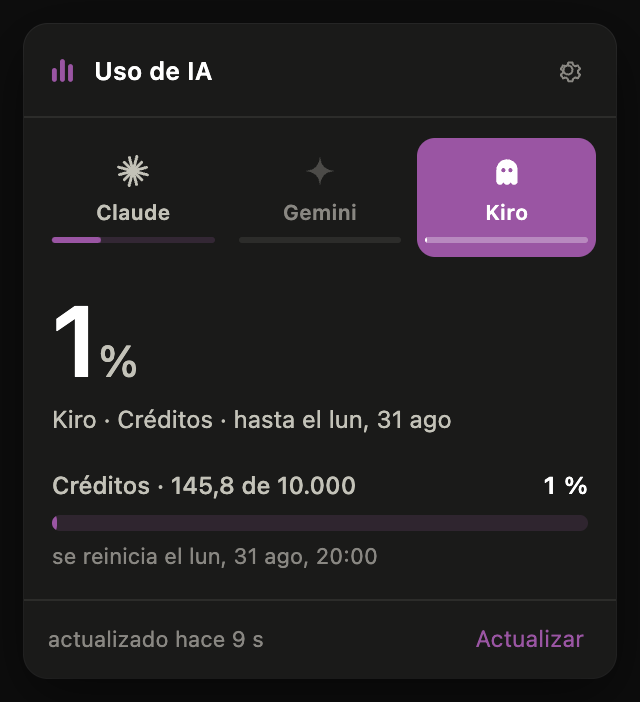
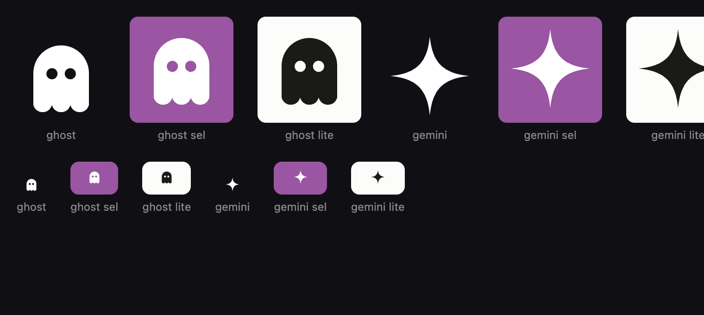

Trabajo a diario con tres asistentes de código distintos y cada uno tiene su
propio límite, su propia ventana de reinicio y su propio sitio donde mirarlo.
La consecuencia práctica es que nunca me enteraba a tiempo: me quedaba sin
sesión a mitad de algo, y sólo entonces iba a mirar el porcentaje.

Así que puse los tres donde siempre los veo.



**[AI Usage Bar](https://github.com/RagnArUCi/ai-usage-bar)** vive en la barra
de menú de macOS y en la bandeja de Windows y Linux. Un porcentaje siempre
visible, y al hacer clic una pastilla por proveedor con sus medidores.

Lee las sesiones que los CLI ya guardaron en tu máquina. No hay que pegar
ningún token en ningún sitio; de hecho no existe un campo donde pegarlo.

## La pregunta que de verdad importa

El porcentaje solo no sirve de mucho. Lo que quieres saber a las cinco de la
tarde es si te llega hasta el reinicio o no.

> A este ritmo te alcanza hasta el reinicio

Eso sale de una regresión sobre tu historial. Y el detalle que costó más: **el
tramo que se mide depende de la duración de la ventana**. Para una sesión de
cinco horas, la última hora describe bien lo que estás haciendo. Para una
ventana semanal, no: extrapolar un ritmo horario a siete días asume que nadie
duerme, y la primera versión te anunciaba muy seria que te quedabas sin cuota
mañana por la mañana. Ahora la ventana semanal se mide sobre 48 horas, que ya
incluyen noches y pausas.

## La parte difícil no era la interfaz

Era que los números fueran ciertos.

**Cada proveedor expone su consumo de una forma distinta**, y en varios casos
la documentación que encuentras no coincide con lo que devuelve la API. Kiro
manda su fecha de reinicio en segundos y además trae un `daysUntilReset` que
llega en 0 aunque el reinicio sea dentro de once días. Gemini te da la fracción
que *queda*, no la consumida, y sirve a la vez dos modelos de la misma familia
que sin la versión en el nombre acaban llamándose igual. Claude, en cambio, es
un gusto: manda un array autodescriptivo con la severidad ya calculada por el
servidor.

Cada contrato está
[documentado](https://github.com/RagnArUCi/ai-usage-bar/tree/main/docs/providers)
tal y como se verificó, no como lo cuenta la documentación oficial.

**Y hay proveedores que no se pueden.** Copilot no expone la cuota de *premium
requests* en ninguna API pública: solo existe un endpoint interno de los
editores, sin garantías. Así que Copilot no está. La regla del proyecto es
explícita:

> Si no se puede leer el consumo real de un proveedor, no se muestra un número.

La pastilla se atenúa y el panel explica qué falta. Un número inventado en una
herramienta cuyo único trabajo es medir es peor que no tener nada.

## El error 429, que resultó no ser lo que parecía

La primera versión fallaba de vez en cuando con un 429. La tentación era
cambiar de método de autenticación —hay apps que usan la cookie de la web— pero
la causa no era la credencial: **era el ritmo**. Consultaba cada 60 segundos sin
pensar, con el mismo token que usa el propio CLI, así que las peticiones se
sumaban.

La solución fue dejar de preguntar a lo tonto. La app vigila la actividad local
de cada CLI y solo entonces consulta seguido; en reposo espera. De unas 1.440
peticiones diarias a unas 290. Y guarda el último dato bueno, así que un fallo
pasajero ya no te muestra un error: te sigue mostrando tu porcentaje con una
nota discreta.

Esa distinción resultó ser el patrón general del proyecto. Otro ejemplo: un
**403** no es una sesión caducada. Gemini responde 403 cuando la cuenta no
tiene licencia de Code Assist, con el token perfectamente válido. Decirle al
usuario "vuelve a iniciar sesión" no arregla nada. Ahora la app distingue 401
de 403 y cita textualmente lo que responde la API.

## Detalles que se notan



Los medidores usan **el color de acento de tu sistema**. Como ese color lo
eliges tú y puede ser cualquiera, la app mide el contraste real y ajusta la
luminosidad hasta 3:1 conservando el matiz: un amarillo claro sobre fondo claro
tiene contraste 1,05, o sea invisible.

Las marcas de los proveedores son siluetas monocromas a propósito, no logos a
todo color. Heredan el color del texto, así que se tiñen solas en claro, en
oscuro y sobre la pastilla seleccionada.

Y no hay ni una imagen en el repositorio: el icono de la app y los de la
bandeja se **dibujan por código**, con un codificador PNG propio de unas
cincuenta líneas. La app no tiene dependencias de runtime.

## Probarlo

```bash
curl -fsSL https://raw.githubusercontent.com/RagnArUCi/ai-usage-bar/main/scripts/install.sh | sh
```

Instaladores para macOS (Apple Silicon e Intel), Windows y Linux en
[Releases](https://github.com/RagnArUCi/ai-usage-bar/releases). Necesita tener
iniciada la sesión del CLI del proveedor que quieras ver.

MIT, y añadir un proveedor son unas cuarenta líneas: un módulo que dice cómo
detectarse en disco y cómo leer su consumo. Si tienes cuenta en Cursor, Codex o
alguno que falte, está
[documentado cómo](https://github.com/RagnArUCi/ai-usage-bar/blob/main/CONTRIBUTING.md).

---

*También existe [una versión solo para Claude](https://github.com/RagnArUCi/claude-usage-bar),
que fue el punto de partida y sigue mantenida.*
